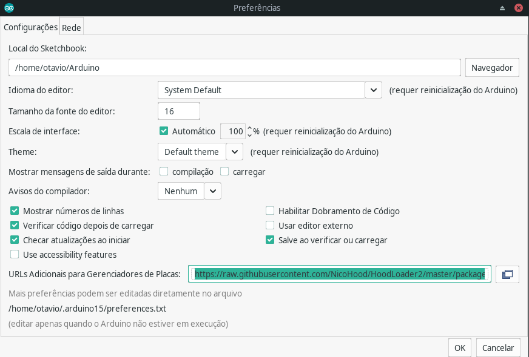
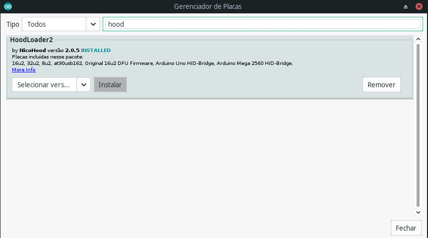
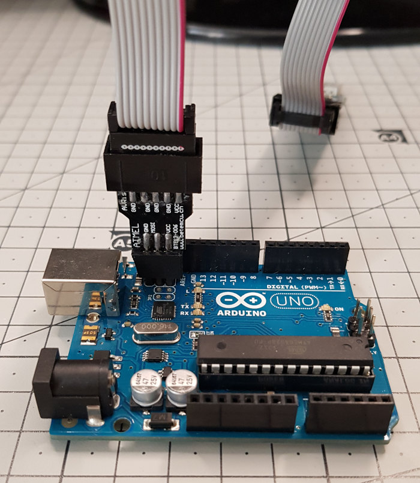
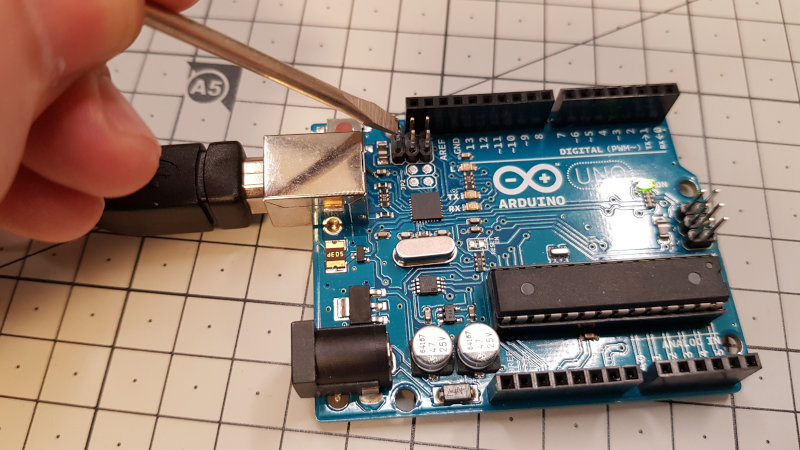
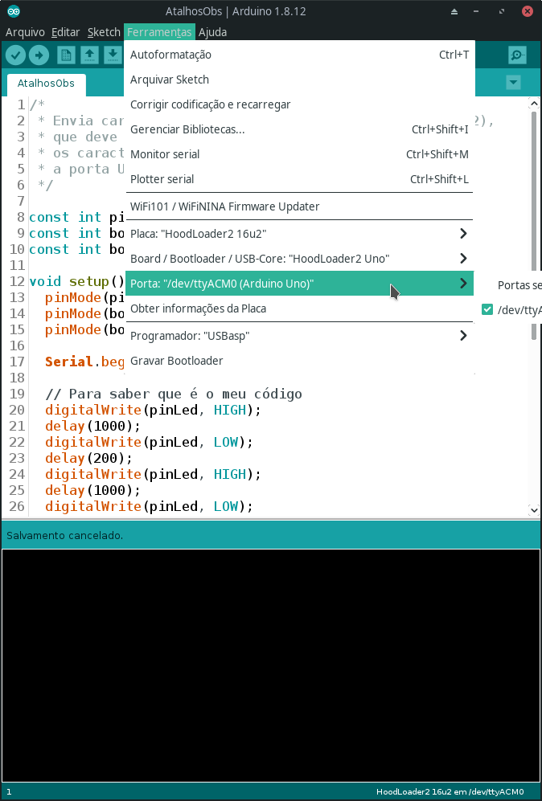
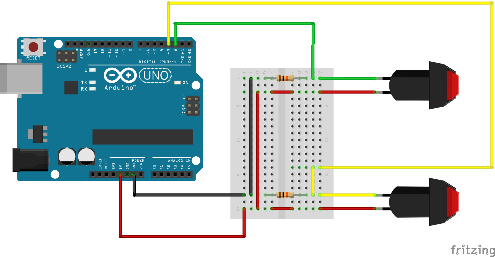

# Arduino como HID

Arduino Uno como dispositivo de interface humana (HID). Faz com que o Arduino seja reconhecido como teclado, mouse ou joystick.

No exemplo deste repositório, os botões conectados ao Arduino servem apenas para mandar as teclas 1 e 2 para o computador. Estas teclas estão associadas a atalhos no OBS (Open Broadcaster Software) para facilitar a seleção de câmeras.

## Vídeo

## Hardware necessário

Para utilizar este código, você vai precisar de:

1) Um Arduino Uno (este código utiliza os dois microcontroladores do Uno, então outros Arduinos podem não ser compatíveis);

2) Um gravador AVR (pode ser um gravador USBASP como eu usei, um segundo Arduino ou outro tipo qualquer).

## Software adicional

Além dos programas contidos nesta biblioteca, você vai precisar de alguns componentes do software [Hoodloader 2](https://github.com/NicoHood/HoodLoader2). Você pode instalá-los por meio da própria Arduino IDE (interface de desenvolvimento do Arduino).

Mais especificamente, você precisa instalar:

1) As definições de placa Hoodloader2 e Arduino AVR Boards (mais a seguir);

2) A biblioteca Hoodloader2 e a biblioteca Keyboard.

### Como instalar

#### 1. Instale as definições de placa

1.1. Dentro da Arduino IDE, acesse Arquivo -> Preferências

1.2. No campo "URLs Adicionais para Gerenciadores de Placas:", inclua a URL do projeto Hoodloader 2:

    https://raw.githubusercontent.com/NicoHood/HoodLoader2/master/package_NicoHood_HoodLoader2_index.json

1.3. Também dentro da Arduino IDE, acesse Ferramentas -> Placa -> Gerenciador de placas...

1.4. Procure "Hoodloader" entre as placas e clique "Instalar"

1.5. Na mesma tela, procure "Arduino AVR Boards" e clique "Instalar".

#### 2. Instale o bootloader do microcontrolador secundário

2.1. Conecte o seu programador USBASP aos pinos mais próximos do conector USB do Arduino.

2.2. Conecte seu programador USBASP a uma porta USB do seu computador.

2.2.1. Se precisar instalar um driver para o programador no Windows, recomendo o programa [Zadig](https://zadig.akeo.ie/).

2.3. Na Arduino IDE, acesse Ferramentas -> Programador e selecione USBasp;

2.4. Na Arduino IDE, acesse Ferramentas -> Placa -> HoodLoader2 16u2;

2.4.1. Se as placas do grupo HoodLoader2 não estiverem disponíveis, certifique-se de ter executado o passo 1 (Instale as definições de placa).

2.5. Ainda na Arduino IDE, acesse Ferramentas -> Gravar Bootloader.

#### 3. Conecte o Arduino ao computador normalmente

3.1. Remova o programador USBasp do Arduino e do PC. Ele não será mais necessário;

3.2. Conecte um cabo USB ao Arduino e ao PC.

#### 4. Instale as bibliotecas necessárias

4.1. Na Arduino IDE, acesse Ferramentas -> Gerenciar Bibliotecas...

4.2. Procure e instale as bibliotecas "HID-Project" e "Keyboard".

#### 5. Grave o programa do microcontrolador secundário (16u2)

5.1. Abra o código "HID16u2_KeyboardBridge.ino" na Arduino IDE;

5.2. Acesse Ferramentas -> Placa -> Hoodloader2 16u2;

5.3. Carregue o código no Arduino:

5.3.1. Acesse Sketch -> Carregar ou clique no botão com uma seta para a direita na Arduino IDE.

#### 6. Altere o modo do microcontrolador para o modo bootloader

6.1. Com o Arduino conectado ao PC, encoste um objeto de metal duas vezes nos dois pinos próximos ao conector USB do Arduino.

6.2. Pode ser necessário tentar algumas vezes. O segundo toque precisa acontecer enquanto o LED L pisca.

6.3. Você vai saber que deu certo quando a Arduino IDE identificar a porta do Arduino com "Arduino Uno" e não mais como "Hoodloader2 16u2".

#### 7. Grave o programa do microcontrolador principal (ATMega328)

7.1. Abra o arquivo "AtalhosObs.ino" e carregue no Arduino Uno.

7.1.1. Para isso, use o botão com uma seta para a direita na IDE ou acesse Sketch -> Carregar.

#### 8. Coloque o microcontrolador secundário de volta ao modo Hoodloader2

8.1. Para colocar o microcontrolador secundário no modo em que ele executa o código que gravamos no passo 5 (Grave o programa do microcontrolador secundário), temos duas opções: 

8.1.1. Repetir o passo 5 e carregar novamente o código "HID16u2_KeyboardBridge.ino"; ou

8.1.2. Dar um curto nos pinos do microcontrolador secundário como no passo 6 (Altere o modo do microcontrolador para o modo bootloader).

#### 9. Conecte os botões ao Arduino

No meu projeto, conectei botões aos pinos 2 e 3. Utilizei resistores de 10k Ohm ligados ao GND para garantir que os pinos recebam 0V quando os botões não estiverem acionados.

Você pode conectar outros tipos de botões ou usar outras estratégias para evitar que os botões flutuem.

### Pronto!

Agora você deve ter um dispositivo que recebe estímulo dos botões e manda as teclas "1" e "2" para o computador quando isso acontece.

Use este código à vontade.

Se encontrar algum problema no código ou na documentação, fique à vontade para submeter um pull request, abrir uma issue ou me mandar um alô no Twitter, no [@ooocarneiro](twitter.com/ooocarneiro). 